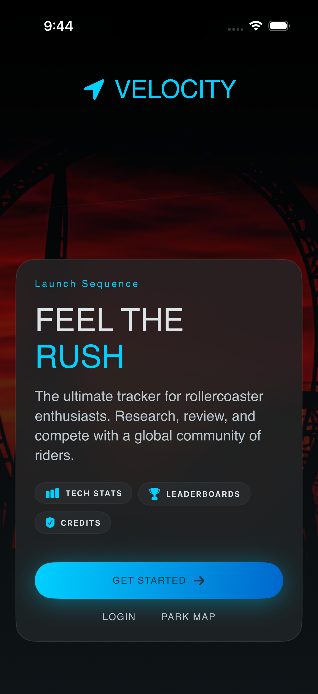

# Velocity

A roller coaster tracking app for iOS. Check in to rides, earn achievements, review coasters, and compete with friends on global and friends leaderboards.



## Features

- **Discover** — Browse nearby coasters (within 200 mi), trending rides, and top-rated worldwide
- **Quick Check-In** — One-tap check-in when you're at a park
- **Coaster Detail** — Stats (speed, height, G-force, inversions, track length), reviews, personal notes
- **Leaderboard** — Global and friends rankings by ride count
- **Profile** — Stats (coasters ridden, max G-force, parks visited, global rank), achievements, recent activity
- **Onboarding** — Animated multi-step flow with location + notification permission requests

## Tech Stack

| Layer | Technology |
|---|---|
| UI | SwiftUI (iOS 17+, `@Observable`) |
| Backend | [Supabase](https://supabase.com) (Postgres + Auth) |
| Location | CoreLocation |
| Fonts | Archivo Narrow, Inter, Space Grotesk |

## Project Structure

```
Velocity/
├── Velocity.xcodeproj
└── Velocity/
    ├── VelocityApp.swift           # Entry point, onboarding gate
    ├── Models/
    │   └── Models.swift            # All Codable/Sendable DTOs
    ├── Services/
    │   ├── SupabaseManager.swift   # Singleton client
    │   ├── RideService.swift       # Ride queries (nearby, trending, search)
    │   ├── ProfileService.swift    # Profile, stats, achievements
    │   ├── CheckInService.swift    # Check-ins, notes, reviews, votes
    │   └── LeaderboardService.swift# Leaderboard + AuthService
    ├── ViewModels/
    │   ├── DiscoverViewModel.swift
    │   ├── ProfileViewModel.swift
    │   ├── LeaderboardViewModel.swift
    │   └── CoasterDetailViewModel.swift
    ├── Views/
    │   ├── Onboarding/             # Welcome → Location → Notifications → ProfileSetup → AllSet
    │   ├── Discover/               # DiscoverView, SelectCoasterView, CoasterCheckInView
    │   ├── CoasterDetail/
    │   ├── Leaderboard/
    │   ├── Profile/
    │   ├── Components/             # Shared reusable views
    │   └── MainTabView.swift       # Tab container (Discover · Ranks · Profile)
    ├── Theme/
    │   └── VelocityTheme.swift     # Colors, typography, spacing, radii
    └── Assets.xcassets
```

## Setup

1. **Clone the repo** and open `Velocity.xcodeproj` in Xcode.
2. **Supabase credentials** — the `SupabaseManager` in `Services/SupabaseManager.swift` holds the project URL and anon key. Replace them with your own if running against a different Supabase project.
3. **Custom fonts** — Archivo Narrow, Inter, and Space Grotesk must be added to the Xcode project and listed in `Info.plist` under `UIAppFonts`.
4. **Build & run** on a simulator or device running iOS 17+.

## Design System

All visual tokens live in `Theme/VelocityTheme.swift`.

**Brand colors**

| Token | Hex | Usage |
|---|---|---|
| `nitroBlue` | `#00d1ff` | Primary actions, highlights, stats |
| `pulseOrange` | `#ff5e07` | Hot/urgent badges, secondary CTAs |
| `velocityBackground` | `#0e1417` | App background |
| `onSurface` | `#dde3e7` | Primary text |

**Type scale** — `Font` extensions: `headlineHero`, `headlineLarge`, `headlineMedium`, `bodyLarge`, `bodyMedium`, `bodySmall`, `labelCaps`, `statValue`, `statValueLarge`

**Spacing** — `VelocitySpacing`: `xs` (8) · `sm` (12) · `md` (16) · `lg` (24) · `xl` (32) · `edgeMargin` (20)

## Database Schema (Supabase)

Core tables: `profile`, `park`, `ride`, `profileRide` (check-ins), `profileRideReview`, `profileRideReviewRating`, `profileRideNote`, `profileRideImage`, `achievement`, `profileAchievement`, `message`, `profileMessage`, `subscriptionType`, `rideRequest`, `rideUpdateRequest`

All snake_case column names are mapped to camelCase in Swift via the Supabase Swift client's default decoder.
